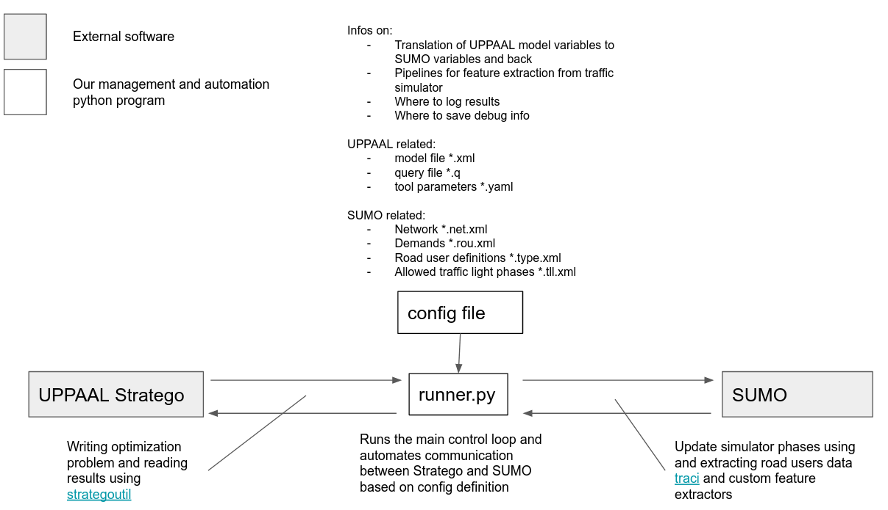

Welcome to SUMO-Stratego

[](https://www.repostatus.org/#active)

<!---when tests are ready
[](https://github.com/mihsamusev/strategoutil/actions)
--->

The purpose of the project is to provide infrastructure that lets use [UPPAAL Stratego](https://people.cs.aau.dk/~marius/stratego/) for traffic light optimization in [SUMO - Simulation of Urban Mobility](https://www.eclipse.org/sumo/).


<p align="center">
    
</p>

## Associated projects
SUMO-Stratego shares ideas of MPC control using UPPAAL Stratego with the following projects:

- [`strategoutil`](https://github.com/mihsamusev/strategoutil) - Python library for Model Predictive Control using UPPAAL Stratego
- [`stratego_mpc_example`](https://github.com/mihsamusev/stratego_mpc_example) - example zoo for `strategoutil`


## Getting started
### Install
```
git clone https://github.com/TRG-BUILD/sumo_stratego.git
cd sumo_stratego
pip install -r requirements.txt

# install config parser as their pip is broken
pip install git+https://github.com/beetbox/confuse.git

python run.py -c tutorial.yaml
```

## Config syntax

The `*.yml` or `*.yaml` job confiuguration file consists of 4 main fields `job`, `uppaal`, `sumo`, and `logging`

### `job`
Specify the name of your job and the root directory containing all relevant job files.

Example:
```yml
job:
  name: my_simulation
  dir: sim
```
### `uppaal`

```yml
uppaal:
  dir: 
  model:
  interface:
  query:
  verifyta:
  debug:
  constants:
  variables:
```
#### `uppaal.constants`
Initiated th esame for all models

#### `uppaal.variables`
Names and formats of the variables fed to the Stratego controller through `uppaal.interface`. More on variable substituion in the UPPAAL Stratego interafce library [strategoutil](https://github.com/mihsamusev/strategoutil).

Example:
```yml
variables:
  queue_A: [0, 0, 0]
  x: 0.0
```
`uppaal.interface` module will try to substitute a pre-defined tag for `queue_A` by list of 3 ints and pre-defined tag for `x` by a float.

### `sumo`

#### `sumo.tls`

#### `extract`

## Project structure
```
run.py
utils
- feature_extraction.py
configs
- job_1.yml
- job_2.yml
jobs
- job_1
    - stratego
        - __init__.py
        - model_template.xml
        - interface.py
        - query.q
    - sumo
        - __init__.py
        - demand
        - network
        - simulation.sumocfg
    - output
    - debug
- job_2
    ...
```


## TODO
- document `*.yml` [configs github workflow style](https://docs.github.com/en/actions/reference/workflow-syntax-for-github-actions)
- add constants, HORIZON, MIN_TIME, MAX_TIME
- running batches
- add logging for state and fcd
- extend loggers to couple with matplotlib and writting states to DB


